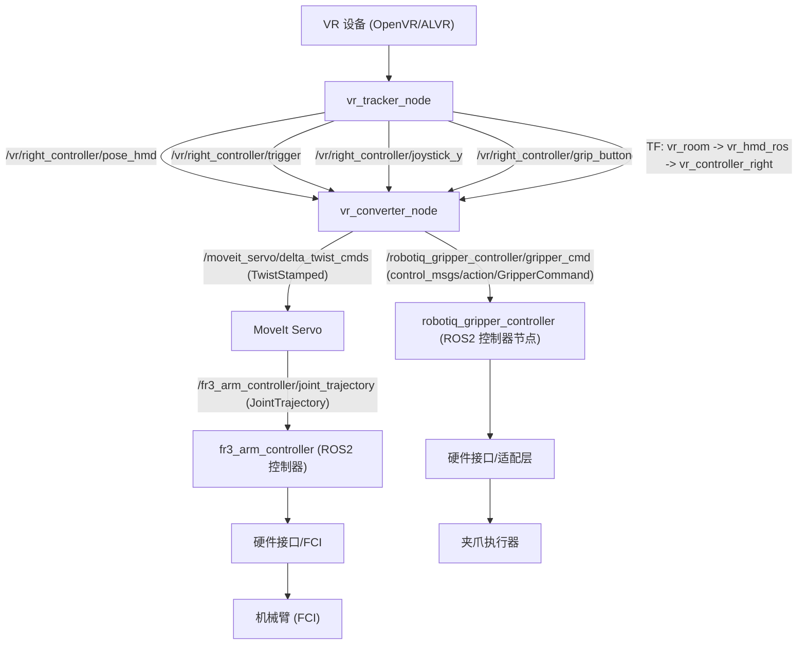

vr_teleop_twist
==============

笛卡尔速度（Twist）遥操包。包含 VR 追踪与速度转换节点，输出给 MoveIt Servo。

控制链路图
--------------------

Twist 速度遥操链路：

节点说明
--------

1) vr_tracker_node
   - 文件：vr_teleop_twist/vr_ros2_node.py
   - 发布：VR 追踪数据与 TF

2) vr_converter_node
   - 文件：vr_teleop_twist/franka_teleop_twist_node.py
   - 订阅：vr_tracker_node 发布的话题
   - 发布：TwistStamped 到 /moveit_servo/delta_twist_cmds（可配置）
   - 发布：control_msgs/action/GripperCommand 到 /robotiq_gripper_controller/gripper_cmd

话题 + 节点表格
--------------

节点 | 所属包 | 订阅 | 发布 | 说明
----|--------|------|------|-----
vr_tracker_node | vr_teleop_twist | (无) | /vr/right_controller/pose_hmd /vr/right_controller/trigger /vr/right_controller/joystick_y /vr/right_controller/a_button /vr/right_controller/grip_button TF: vr_room -> vr_hmd_ros -> vr_controller_right | 读取 OpenVR/ALVR 并发布 VR 数据与 TF
vr_converter_node | vr_teleop_twist | /vr/right_controller/pose_hmd /vr/right_controller/trigger /vr/right_controller/joystick_y /vr/right_controller/grip_button | /moveit_servo/delta_twist_cmds (TwistStamped) /robotiq_gripper_controller/gripper_cmd (control_msgs/action/GripperCommand) | 速度遥操（扳机触发 + 锚点相对位姿）
moveit_servo | MoveIt Servo | /moveit_servo/delta_twist_cmds | 控制器输出话题 | 将 Twist 转换为关节控制指令
fr3_arm_controller | ros2_control | /fr3_arm_controller/joint_trajectory (JointTrajectory) | (ros2_control 内部接口) | ROS2 控制器（JointTrajectoryController）
robotiq_gripper_controller | ros2_control | /robotiq_gripper_controller/gripper_cmd (control_msgs/action/GripperCommand) | (ros2_control 内部接口) | ROS2 夹爪控制器（joint: robotiq_85_left_knuckle_joint）

说明
----
- 控制器由 ros2_control_node (controller_manager) 负责加载与管理。

配置
----
- vr_teleop_twist/config/teleop_params.yaml

参数说明
--------

A) VR 追踪参数（vr_tracker_node.ros__parameters）
- update_rate：VR 数据发布频率 (Hz)，通常 90Hz。
- publish_tf：是否发布 TF。
- frame_id：VR 原点坐标系名（如 vr_room）。
- hmd_frame_id：头显坐标系名（如 vr_hmd_ros）。
- enable_right_controller：是否启用右手控制器。
- haptic_on_trigger：扳机按下时是否触发震动。
- haptic_duration_us：震动时长 (us)，OpenVR 上限 3999。
- reinit_interval：初始化失败后的重试间隔 (s)。

B) 速度遥操参数（vr_converter_node.ros__parameters）
- linear_scale：线速度缩放系数。
- angular_scale：角速度缩放系数。
- v_max：线速度上限 (m/s)。
- w_max：角速度上限 (rad/s)。
- smoothing_factor：速度低通滤波系数 (0~1)。
- deadzone_linear：线速度死区阈值 (m)。
- deadzone_angular：角速度死区阈值 (rad)。
- trigger_threshold：扳机触发阈值。
- planning_frame：MoveIt/机器人基坐标系（如 fr3_link0）。
- ee_frame：末端执行器 TF 坐标系（如 robotiq_85_base_link）。
- publish_rate：速度指令发布频率 (Hz)。
- gripper_tcp_xyz：TCP 相对 base_link 的平移 (m)。
- gripper_tcp_rpy：TCP 相对 base_link 的旋转 (deg)。
- twist_topic：MoveIt Servo 速度指令话题。
- gripper_action：夹爪 GripperCommand action 名称。
- gripper_open_pos：夹爪张开目标位置。
- gripper_close_pos：夹爪闭合目标位置。
- gripper_force：夹爪最大力。
- gripper_speed：夹爪速度（与位置增量相关）。
- gripper_axis_deadzone：摇杆死区阈值。
- gripper_deadband：夹爪位置变化小于该值时不发送新命令。
- gripper_rate：夹爪指令发送频率 (Hz)。

备注
----
- 遥操使用“扳机触发 + 锚点相对位姿”的逻辑，并支持夹爪控制。
- 发布频率、缩放系数、话题名等参数请在 YAML 中调整。

增量模式（不使用锚点）
--------------------
当 `use_anchor: false` 时，不建立 VR/末端“锚点”。速度由**上一帧与当前帧的控制器相对位姿增量**计算得到，流程如下：

1) 读取当前帧控制器相对头显位姿 `vr_p_now, vr_q_now`。
2) 若是首次帧（`last_vr_p/q` 为空），仅缓存当前帧并输出零速度。
3) 计算上一帧到当前帧的增量位姿：
   - `dvr_p, dvr_q = pose_inverse(last) ∘ pose_compose(now)`
   - 将 `dvr_p/dt` 与 `rotvec(dvr_q)/dt` 转换为线速度和角速度。
4) 叠加 `linear_scale/angular_scale` 与 `z_scale`，再做死区、限速、滤波与门控。

启动与停用细节：
- 当扳机使能时会进入 `startup_active`，在 `soft_stop_duration` 时间内输出零速度，用于“对齐上一帧缓存”；之后开始按增量计算速度。
- 当扳机松开或未使能时，会清空 `last_vr_p/q`，下一次启用再次从“首帧零速度”开始。
